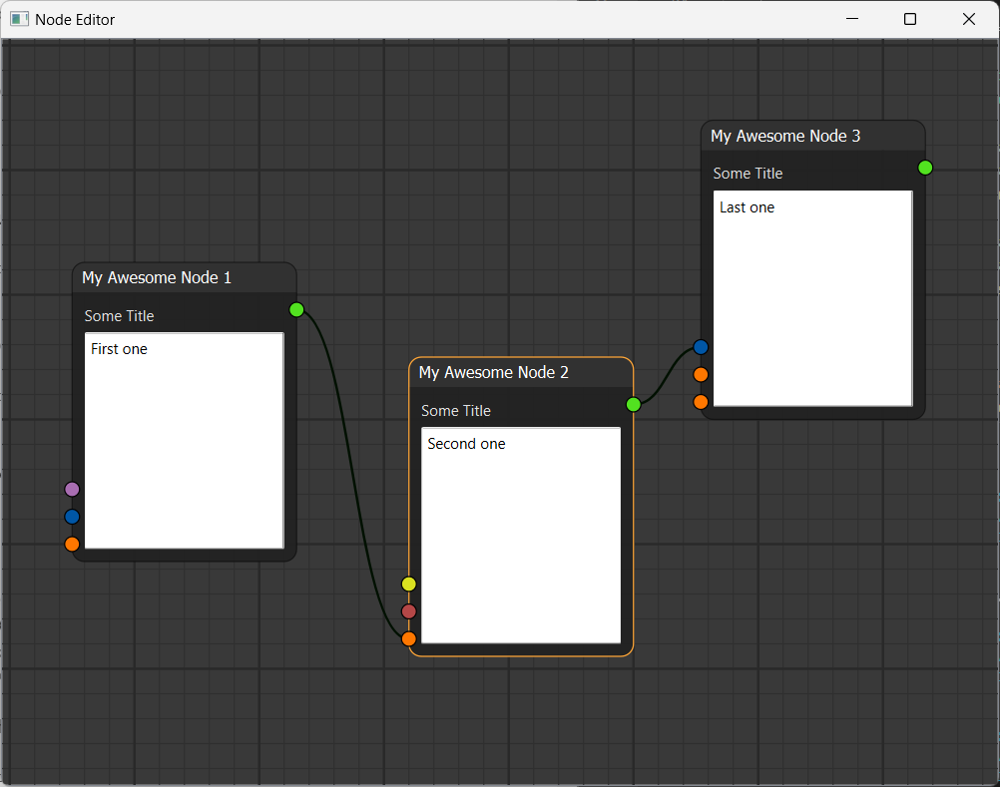

# Qt Node Editor
This project follows Pavel Křupala tutorial series.
It uses Qt 6 and qtpy abstraction layer. Poetry is used to manage dependencies.

## See also
* [Node Editor in Python Tutorial Series](https://www.blenderfreak.com/tutorials/node-editor-tutorial-series/)
([pavel.krupala/pyqt-node-editor](https://gitlab.com/pavel.krupala/pyqt-node-editor))
* [beyse/NodeEditor](https://github.com/beyse/NodeEditor)
* [klauer/qtpynodeeditor](https://github.com/klauer/qtpynodeeditor) (Python implementation of [paceholder/nodeeditor](https://github.com/paceholder/nodeeditor))
* [Nodezator](https://nodezator.com/)
* [tangle](https://github.com/nielsvaes/tangle) `uvx -p 3.10 --with ez_qt<2 --with pillow<10 --with numpy<2 --from tangle-node-editor tangle`
* [NodeGraphQt](https://github.com/jchanvfx/NodeGraphQt)
* [Ryven](https://ryven.org)
* [Barfi](https://github.com/krish-adi/barfi)
* [pedroCabrera/PyFlow](https://github.com/pedroCabrera/PyFlow)
* [Bycelium/PyFlow](https://github.com/Bycelium/PyFlow)
